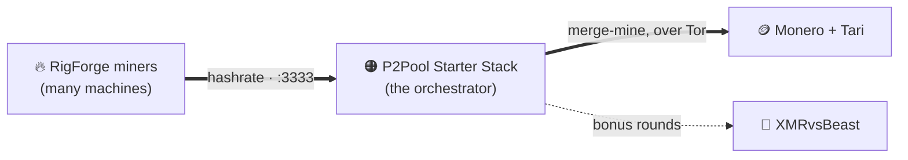

# Private Monero mining, self-hosted — the whole operation 🧅⛏️

> An **orchestrator** and the **miners** that feed it. Two open-source projects for running a
> private, optimized **Monero + Tari** mining operation on hardware you own — no custodians, no
> exposed home IP, no hand-tuning.

---

## 🧩 The projects

### 🟠 [P2Pool Starter Stack](https://github.com/p2pool-starter-stack/p2pool-starter-stack) — the orchestrator

A professional-grade, containerized stack that runs a private Monero full node, **P2Pool**, **Tari**
merge mining, a single mining endpoint, and a live dashboard — all behind **Tor**, in one command.

- 🧅 **Private by default** — Tor hidden services for Monero, Tari, and P2Pool; no port forwarding, no exposed IP.
- ⛏️ **Monero + Tari, merge-mined** — earn on both chains at once, with zero extra effort.
- 🧠 **Algorithmic yield optimization** — continuously splits your hashrate between P2Pool and XMRvsBeast bonus rounds to maximize return.
- 🔌 **One endpoint for every rig** — all your miners point at a single address; the stack routes hashrate upstream.
- 📊 **A dashboard that actually tells you things** — live hashrate, sync progress, PPLNS window, and per-worker stats, served over HTTPS on your LAN.
- 🔒 **Hardened out of the box** — least-privilege containers, SHA256-verified pinned binaries, and tightly scoped Docker-socket proxies.

### 🔥 [RigForge](https://github.com/p2pool-starter-stack/rigforge) — the miners

Turn any machine into a tuned mining worker in one command. RigForge builds stock **XMRig** from
source, applies CPU- and kernel-level tuning for maximum RandomX hashrate, and runs it as a managed
service — then points it at your stack.

- ⚡ **One command** from bare metal to a running, tuned miner.
- 🧠 **Hardware-aware** — detects your CPU (AMD EPYC, Ryzen X3D, …) and applies a matching performance profile.
- ⚙️ **Kernel-tuned** — HugePages (1 GB / 2 MB), MSR access, and NUMA binding, done for you.
- 🔧 **Managed** — runs as a `systemd` service with a performance governor and automatic log rotation.
- 🔗 **Plug-and-play** — connects to the Starter Stack, or any RandomX Stratum pool.

### 🔗 How they fit together

Point as many RigForge miners as you like at a single Starter Stack. The stack handles the nodes,
privacy, payouts, and optimization; the miners just hash.

---

## 🛠️ How we build

A few principles you'll see throughout the code:

- **Privacy is the default, not a setting.** Tor-only upstreams, localhost-bound RPC, and no public
  port forwarding. You opt *out* of privacy — never *in*.
- **Least privilege, everywhere.** Capability-scoped containers, a read-only Docker-socket proxy
  kept separate from a start/stop-only one, owner-only secrets. Nothing gets more access than it
  needs.
- **Verifiable and pinned.** Third-party binaries are SHA256-checked and version-pinned — no
  `curl | bash` trust.
- **The *why* lives in the code.** Non-obvious decisions are documented inline with their reasoning
  and the issue that drove them, so the next person — or the next you — understands the trade-off.
- **Small, reversible, issue-driven changes.** Work is scoped to focused issues; config changes are
  previewed and warn before anything disruptive; failures degrade gracefully (clean OOM handling,
  node-down failover, hold-the-miner-until-synced).
- **Respect the operator's time and hardware.** Sensible auto-tuning, one-command setup, and docs
  treated as a first-class deliverable — *"a setup you can finish before your coffee gets cold."*

---

## 🚀 Start here

- **New to this?** → [**P2Pool Starter Stack**](https://github.com/p2pool-starter-stack/p2pool-starter-stack) gets the whole operation running in one command.
- **Already have the stack?** → [**RigForge**](https://github.com/p2pool-starter-stack/rigforge) provisions your miners.

Everything here is **MIT-licensed** and built in the open. Issues and pull requests are welcome.
