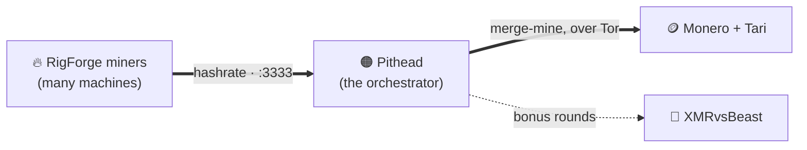

# P2Pool Starter Stack

### Mine Monero privately, on hardware you own — the whole operation, in one command. 🧅⛏️

> Two open-source projects for running a **private, optimized Monero + Tari mining operation** at
> home: an **orchestrator** ([Pithead](https://github.com/p2pool-starter-stack/pithead)) and the
> **miners** that feed it ([RigForge](https://github.com/p2pool-starter-stack/rigforge)). Decentralized,
> **zero-fee P2Pool** payouts straight to your own wallet, all behind **Tor** — no custodians, no
> exposed home IP, no pool fees, no hand-tuning.

**🌐 [p2pool-starter-stack.github.io](https://p2pool-starter-stack.github.io/)**  ·  free & MIT  ·  no token  ·  no premine  ·  no VC  ·  Tor-first

---

## 🧩 The projects

### 🟠 [Pithead](https://github.com/p2pool-starter-stack/pithead) — the orchestrator

A professional-grade, containerized stack that runs a private Monero full node, **P2Pool**, **Tari**
merge mining, a single mining endpoint, and a live dashboard — all behind **Tor**, in one command.

- 🧅 **Private by default** — Tor hidden services for Monero, Tari, and P2Pool; your router stays shut and your home IP is never advertised to an inbound peer.
- ⛏️ **Monero + Tari, merge-mined** — every hash mines Monero on zero-fee P2Pool and merge-mines Tari at once: a second payout for zero extra power or config.
- 🧠 **Algorithmic yield optimization** — watches the XMRvsBeast raffle and shifts hashrate to grab bonus rounds, donating only the minimum to hold your tier, then handing every spare cycle back to your own P2Pool payouts.
- 🔌 **One endpoint for every rig** — all your miners point at a single address; no wallet in the miner, no per-rig pool config.
- 📊 **A dashboard worth leaving open** — live hashrate, the P2Pool/XvB split shading in real time, the PPLNS window, an honest tier + explicit VIP status, and per-worker stats, served over HTTPS on your LAN.
- 🔒 **Hardened out of the box** — least-privilege containers, SHA256-verified pinned binaries, and tightly scoped Docker-socket proxies (read-only for stats, start/stop-only for failover).

### 🔥 [RigForge](https://github.com/p2pool-starter-stack/rigforge) — the miners

Turn any Ubuntu/Debian — or macOS — machine into a tuned mining worker in one command. RigForge
compiles stock, commit-pinned **XMRig** from source, applies CPU- and kernel-level tuning for maximum
RandomX hashrate, and runs it as a managed service — then points it at your stack, or any RandomX pool.

- ⚡ **One command** from bare metal to a running, tuned miner — on Ubuntu/Debian or macOS.
- 📈 **Measurably faster, and cooler** — +3.5% hashrate and +7.6% efficiency on a Ryzen 7800X3D, measured live against stock XMRig (and +6.6% on a 48-core EPYC).
- 🧠 **Hardware-aware** — detects your CPU (AMD EPYC, Ryzen X3D, …), applies a matching profile, then live-A/Bs the hardware prefetcher to keep the fastest.
- ⚙️ **Kernel-tuned (Linux)** — HugePages (1 GB / 2 MB), MSR access, NUMA binding, and a performance governor, done for you.
- 🔗 **Plug-and-play** — connects to Pithead, or any RandomX Stratum pool. Stock XMRig pinned to a verified commit — no custom binary, a 0% dev fee, idempotent re-runs.

### 🔗 How they fit together

Point as many RigForge miners as you like at a single Pithead. The stack handles the nodes,
privacy, payouts, and optimization; the miners just hash.

---

## ❓ Common questions

**How do I mine Monero privately at home?**
Run the P2Pool Starter Stack. One command stands up a private Monero full node, P2Pool, and a single
mining endpoint behind Tor — your home IP is never advertised to an inbound peer and you never forward
a port. Point any XMRig rig (or a RigForge worker) at it and you're mining straight to your own wallet,
no account and no custodian.

**Do I have to forward ports or expose my home IP?**
No. Monero, Tari, and P2Pool run as Tor hidden services, so inbound peers reach you over an onion
address and your router stays shut; RPC is localhost-bound. The few outbound yield paths still on
clearnet in v1.0 are mapped in the privacy guide and move to Tor-by-default in v1.1.

**What is P2Pool, and why mine to it instead of a centralized pool?**
P2Pool is a decentralized, peer-to-peer Monero mining pool: no operator, no account, and no pool fee —
the network pays block rewards straight to your own wallet. The stack runs your own P2Pool node, so you
get decentralized, zero-fee payouts without the fiddly setup.

**Is it free? Are there any fees?**
Yes — free and MIT-licensed. P2Pool charges no pool fee, and RigForge compiles stock XMRig with the
dev-fee pinned to 0%. No token, no premine, no VC — just an optional Monero donation if a stack saves
you time.

**Can I point my existing XMRig miners at it?**
Yes — point any XMRig or RandomX rig at the stack's single endpoint (`host:3333`), no wallet in the
miner. For maximum hashrate, RigForge provisions a kernel-tuned XMRig worker in one command
(+3.5% hashrate / +7.6% efficiency on a Ryzen 7800X3D vs stock).

**What hardware do I need?**
Stack host: Ubuntu Server 24.04, 16 GB+ RAM, an SSD (~300 GB pruned; 2–4 TB for set-and-forget).
Mining itself is CPU-bound — Monero's RandomX runs on any modern AMD/Intel CPU, and large-L3 chips
(Ryzen X3D, EPYC) shine. RigForge tunes per-CPU automatically.

---

## 🛠️ How we build

A few principles you'll see throughout the code:

- **Privacy is the default, not a setting.** Inbound rides Tor hidden services — no port forwarding,
  your home IP never advertised to a peer — and RPC is localhost-bound. The few outbound paths that
  still touch clearnet in v1.0 are mapped in the privacy guide and move to Tor-by-default in v1.1.
- **Least privilege, everywhere.** Capability-scoped containers, a read-only Docker-socket proxy
  kept separate from a start/stop-only one, owner-only secrets. Nothing gets more access than it
  needs.
- **Verifiable and pinned.** Third-party binaries are SHA256-checked and version-pinned — no
  `curl | bash` trust.
- **The *why* lives in the code.** Non-obvious decisions are documented inline with their reasoning
  and the issue that drove them, so the next person — or the next you — understands the trade-off.
- **Small, reversible, issue-driven changes.** Work is scoped to focused issues; config changes are
  previewed and warn before anything disruptive; failures degrade gracefully (clean OOM handling,
  node-down failover, hold-the-miner-until-synced).
- **Respect the operator's time and hardware.** Sensible auto-tuning, one-command setup, and docs
  treated as a first-class deliverable — *"a setup you can finish before your coffee gets cold."*

---

## 🚀 Start here

- **New to this?** → [**Pithead**](https://github.com/p2pool-starter-stack/pithead) gets the whole operation running in one command.
- **Already have the stack?** → [**RigForge**](https://github.com/p2pool-starter-stack/rigforge) provisions your miners.
- **Want the overview?** → [**p2pool-starter-stack.github.io**](https://p2pool-starter-stack.github.io/)

Both projects are at their **v1.0** — RigForge complete, Pithead feature-complete and through its
release gate. Everything here is **MIT-licensed** and built in the open. Issues and pull requests are welcome.
